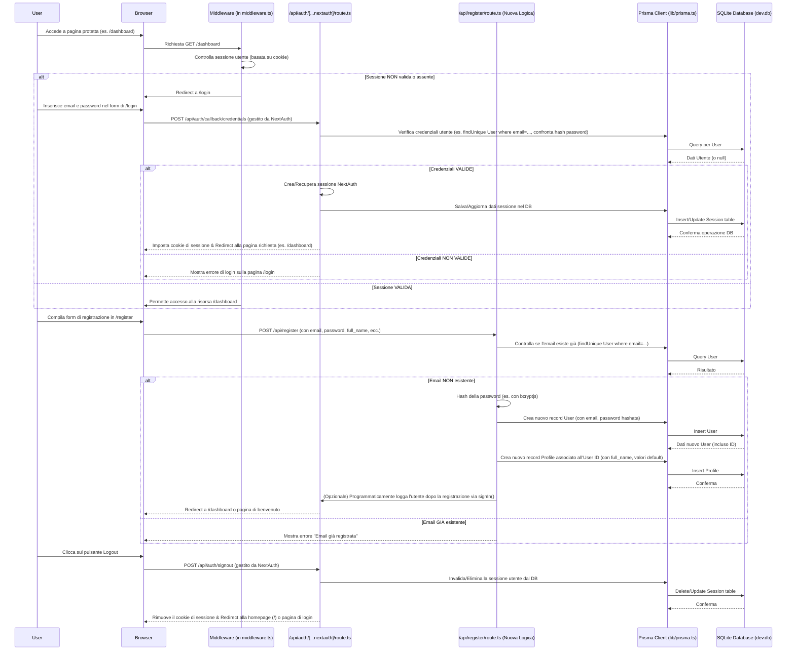

# Piano di Migrazione da Supabase a SQLite per Fire Tracker

## 1. Analisi Conclusa e Punti Chiave Identificati

L'analisi iniziale del codebase di Fire Tracker ha rivelato un'integrazione profonda di Supabase per le seguenti funzionalità chiave:

*   **Autenticazione:** Gestione completa degli utenti, delle sessioni e dei token.
*   **Database Principale:** Utilizzo di PostgreSQL come backend, con uno schema definito che include tabelle, Row Level Security (RLS) e trigger per automatizzare determinate operazioni (es. creazione profili utente).
*   **Client Specifici:** Implementazione di client dedicati per le interazioni con Supabase sia dal lato server (Server Components, API Routes, Middleware) sia dal lato client (Client Components).
*   **Funzionalità Real-time:** Utilizzo delle capacità real-time di Supabase, in particolare per gli aggiornamenti del portafoglio di investimento.

I file principali coinvolti nell'integrazione di Supabase includono:
*   Client Supabase: [`lib/supabase-client.ts`](lib/supabase-client.ts:1), [`lib/supabase-server.ts`](lib/supabase-server.ts:1), [`lib/supabase.ts`](lib/supabase.ts:1).
*   Accesso al Database: [`lib/db.ts`](lib/db.ts:1), [`lib/db-client.ts`](lib/db-client.ts:1), [`lib/budget-client.ts`](lib/budget-client.ts:1), [`lib/financial-transactions-client.ts`](lib/financial-transactions-client.ts:1), [`lib/goals-client.ts`](lib/goals-client.ts:1).
*   Autenticazione: [`middleware.ts`](middleware.ts:1), varie chiamate a `supabase.auth` in componenti e hooks, e API routes come [`app/api/register/route.ts`](app/api/register/route.ts:1).
*   Definizioni Tipi e Schema: [`types/supabase.ts`](types/supabase.ts:1), [`supabase/schema.sql`](supabase/schema.sql:1) e altri file SQL nella directory `supabase/`.
*   Componenti UI e Hooks: Numerosi file in `components/` e `hooks/`.
*   Script e Configurazioni: Script in `scripts/`, file di configurazione delle dipendenze e documentazione Markdown.

## 2. Strategia di Autenticazione con SQLite

Si propone di adottare **`next-auth`** (versione 5 o successiva) per la gestione dell'autenticazione.

*   **Motivazione:** `next-auth` è una libreria robusta, sicura e ampiamente utilizzata all'interno dell'ecosistema Next.js. Offre un'eccellente integrazione con l'App Router, gestione delle sessioni, provider OAuth (per future espansioni) e callback personalizzabili che saranno cruciali per replicare la logica di creazione dei profili.
*   **Adapter:**
    *   Se si sceglie Prisma come ORM (consigliato al punto 3), si utilizzerà **`@auth/prisma-adapter`**. Questo adapter si occuperà di creare e gestire le tabelle necessarie per `next-auth` (users, sessions, accounts, verificationTokens) all'interno del database SQLite.
    *   In alternativa, con un approccio più manuale (es. `better-sqlite3`), potrebbe essere necessario sviluppare un adapter custom o cercare un adapter SQL generico compatibile.
*   **Gestione Utenti e Sessioni:**
    *   `next-auth` e il suo adapter gestiranno la creazione delle tabelle di autenticazione.
    *   La logica attualmente presente nel trigger `handle_new_user` di Supabase (per creare un record nella tabella `profiles` quando un nuovo utente si registra in `auth.users`) dovrà essere spostata. Questo può essere fatto all'interno dei callback di `next-auth` (come `signIn` o `jwt`) oppure gestito da una API route di registrazione custom che, dopo aver creato l'utente tramite `next-auth`, procederà a creare il profilo associato.

## 3. Nuovo Client e ORM per SQLite

Si raccomanda l'utilizzo di **Prisma** come ORM per interagire con il database SQLite.

*   **Motivazione:**
    *   **Type Safety:** Prisma genera automaticamente tipi TypeScript basati sullo schema del database, garantendo una forte type safety e migliorando l'esperienza di sviluppo, in modo simile a quanto offerto da `types/supabase.ts`.
    *   **Migrazioni:** Fornisce un sistema di migrazioni dichiarativo e potente (`prisma migrate dev`) che semplifica la creazione, l'evoluzione e il versionamento dello schema del database SQLite.
    *   **Client Intuitivo:** Offre un'API client fluente e facile da usare per eseguire query sul database.
    *   **Supporto SQLite:** Ha un eccellente supporto per SQLite.
*   **Alternativa (più leggera e manuale):**
    *   Utilizzare `better-sqlite3` per l'accesso diretto e a basso livello al database SQLite, possibilmente combinato con **Kysely** come query builder type-safe.
    *   **Motivazione:** Questo approccio offre maggiore controllo sulle query SQL e può portare a performance migliori per query molto complesse, se ottimizzate manualmente. Tuttavia, richiede più lavoro per la gestione dei tipi e delle migrazioni.
*   **Struttura del Client Prisma:**
    *   Verrà creato un file, ad esempio `lib/prisma.ts` (o si potrebbe rinominare e rifattorizzare l'esistente `lib/db.ts`), che inizializzerà ed esporterà un'istanza globale del `PrismaClient`. Questa istanza sarà utilizzata in tutto il backend dell'applicazione per interagire con SQLite.

## 4. Dipendenze

Sarà necessario modificare le dipendenze del progetto come segue:

*   **Da Aggiungere:**
    *   `next-auth` (per l'autenticazione)
    *   `@auth/prisma-adapter` (se si utilizza Prisma con `next-auth`)
    *   `prisma` (come dev dependency, per la CLI di Prisma)
    *   `@prisma/client` (il client Prisma generato)
    *   `bcryptjs` (per l'hashing delle password, se non gestito internamente da `next-auth` o per logiche custom)
    *   `sqlite3` (anche se Prisma gestisce il suo driver, a volte è una peer dependency)
*   **Da Rimuovere:**
    *   `@supabase/ssr`
    *   `@supabase/supabase-js`
    *   `@supabase/auth-helpers-nextjs`
    *   Qualsiasi altra dipendenza specifica del pacchetto `@supabase/*` (es. `@supabase/postgrest-js`, `@supabase/realtime-js`).

## 5. Modifiche ai File Esistenti

La migrazione richiederà modifiche significative in diverse parti del codebase:

*   **Client Supabase (`lib/supabase-client.ts`, `lib/supabase-server.ts`, `lib/supabase.ts`):**
    *   Questi file verranno eliminati. Le loro funzionalità saranno sostituite dall'istanza di `PrismaClient` e dalla configurazione e dai metodi forniti da `next-auth`.
*   **Logica di Accesso al Database (tutti i file in `lib/*-client.ts`, `lib/db.ts`):**
    *   Questi file dovranno essere completamente riscritti. Le attuali funzioni che utilizzano la sintassi di Supabase (es. `supabase.from(...).select()`) dovranno essere tradotte per utilizzare le API di Prisma (es. `prisma.user.findUnique()`, `prisma.transaction.create()`).
*   **Route API (`app/api/...`):**
    *   **Autenticazione:** Le chiamate a `supabase.auth.getUser()` saranno sostituite con `getServerSession(authOptions)` fornito da `next-auth` per recuperare le informazioni sulla sessione dell'utente.
    *   **Operazioni DB:** Tutte le interazioni con il database utilizzeranno il client Prisma.
    *   [`app/api/register/route.ts`](app/api/register/route.ts:1): Questa route dovrà essere modificata per validare i dati dell'utente, quindi utilizzare una funzione (che a sua volta potrebbe usare `next-auth` o direttamente Prisma con hashing via `bcryptjs`) per creare il nuovo utente e il profilo associato nel database SQLite. Non si baserà più su trigger a livello di database per la creazione del profilo.
    *   Le route di callback specifiche di Supabase (es. `app/auth/callback/*`) saranno rimosse e sostituite dalle route gestite automaticamente da `next-auth` (tipicamente una singola route catch-all come `app/api/auth/[...nextauth]/route.ts`).
*   **Componenti React e Hooks (`components/`, `hooks/`, pagine in `app/`):**
    *   **Autenticazione:**
        *   L'utilizzo di `createClientComponentClient()` e delle API `supabase.auth.*` sarà sostituito dall'hook `useSession()` di `next-auth/react` per accedere ai dati della sessione e dalle funzioni `signIn()` e `signOut()` per le azioni di login/logout.
        *   L'hook [`hooks/use-auth-sync.ts`](hooks/use-auth-sync.ts:1) sarà probabilmente obsoleto o richiederà una profonda revisione.
    *   **Accesso ai Dati (Client Components):**
        *   Le chiamate dirette al database da Client Components sono generalmente sconsigliate. Si dovrà valutare se modificare questi componenti per recuperare i dati tramite API Routes (che a loro volta useranno Prisma) o, se appropriato per la versione di Next.js utilizzata (13+), tramite Server Actions.
    *   **Accesso ai Dati (Server Components):** I Server Components potranno importare e utilizzare direttamente l'istanza di `PrismaClient` per recuperare i dati.
    *   **Funzionalità Real-time (es. in [`hooks/use-portfolio-data.ts`](hooks/use-portfolio-data.ts:1)):** La sottoscrizione ai canali real-time di Supabase (`supabase.channel(...)`) non ha un equivalente diretto con una soluzione basata su SQLite. Si dovranno considerare le seguenti opzioni:
        1.  **Rimuovere la funzionalità real-time:** Se non strettamente critica.
        2.  **Implementare Polling Periodico:** I client potrebbero richiedere aggiornamenti a intervalli regolari.
        3.  **Introdurre una Soluzione WebSocket Custom:** Questo aggiungerebbe complessità significativa ma manterrebbe la reattività.
        *La decisione dipenderà dalla criticità della feature real-time per l'esperienza utente.*
*   **Tipi (`types/supabase.ts`):**
    *   Questo file diventerà obsoleto. Prisma genererà automaticamente i tipi TypeScript per tutti i modelli definiti nello schema Prisma. Questi tipi saranno importabili da `@prisma/client`.
    *   Eventuali tipi custom aggiuntivi non correlati direttamente ai modelli del database potranno essere mantenuti o spostati in un file dedicato (es. `types/index.ts`).
*   **Middleware (`middleware.ts`):**
    *   Sarà sostituito con il middleware fornito da `next-auth`. La configurazione avverrà importando `default` da `next-auth/middleware` e specificando le route protette e pubbliche nel `matcher` del file `middleware.ts`.
    *   La logica di controllo del `view_mode` (attualmente nel middleware Supabase) dovrà essere adattata. Il middleware di `next-auth` potrebbe accedere al database per questo controllo (se possibile e considerato sicuro) oppure reindirizzare a una pagina o API specifica che gestisce questa logica dopo l'autenticazione.
*   **Schema Database (directory `supabase/`):**
    *   **Nuovo Schema Prisma:** Verrà creato un file `prisma/schema.prisma`.
        *   All'interno di questo file, verranno definiti i modelli Prisma per tutte le tabelle attualmente esistenti (`profiles`, `net_worth`, `expenses`, `goals`, `transactions`, `investment_goals`, `portfolio_allocations`, `financial_transactions`, `portfolio_holdings`, `budgets`, `budget_alerts`), traducendo i tipi di dato SQL in tipi Prisma compatibili con SQLite.
        *   Verranno definiti anche i modelli richiesti da `next-auth` per il suo funzionamento (`User`, `Account`, `Session`, `VerificationToken`) e verranno stabilite le relazioni appropriate (es. tra il modello `User` di `next-auth` e il modello `Profile` dell'applicazione).
    *   **Migrazioni:** Si utilizzerà il comando `prisma migrate dev` per generare i file di migrazione SQL (specifici per SQLite) e per applicare tali migrazioni al database di sviluppo.
    *   I file `.sql` esistenti nella directory `supabase/` (come `schema.sql`, `investment-schema.sql`, ecc.) serviranno come prezioso riferimento per definire correttamente i modelli Prisma e per tradurre eventuali logiche di default o constraint.
*   **Script (directory `scripts/`, `simple-schema-check.js`):**
    *   Gli script che attualmente interagiscono con Supabase dovranno essere riscritti per utilizzare il client Prisma.
*   **Variabili d'Ambiente (`.env.local`, `.env.example`):**
    *   Le variabili `NEXT_PUBLIC_SUPABASE_URL`, `NEXT_PUBLIC_SUPABASE_ANON_KEY`, e `SUPABASE_SERVICE_ROLE_KEY` saranno rimosse.
    *   Verrà aggiunta la variabile `DATABASE_URL` per specificare il percorso del file SQLite (es. `DATABASE_URL="file:./dev.db"`).
    *   Verranno aggiunte le variabili richieste da `next-auth`, come `NEXTAUTH_URL` (l'URL base dell'applicazione) e `NEXTAUTH_SECRET` (una stringa segreta per la firma dei token).

## 6. Script di Migrazione Schema (da Supabase SQL a Prisma/SQLite)

Sarà necessario un processo per tradurre la struttura dello schema attuale da PostgreSQL (definito nei file SQL di Supabase) a uno schema Prisma compatibile con SQLite.

*   **Processo Dettagliato:**
    1.  **Analisi Approfondita:** Esaminare attentamente [`supabase/schema.sql`](supabase/schema.sql:1) e tutti gli altri file SQL rilevanti (es. `investment-schema.sql`, `add-budgets-table.sql`, `financial-transactions-schema.sql`) per comprendere appieno tutte le tabelle, colonne, tipi di dato, relazioni, indici, constraint e trigger.
    2.  **Definizione Manuale dei Modelli Prisma:** Creare i modelli corrispondenti nel file `prisma/schema.prisma`.
        *   **Mappatura Tipi di Dato:**
            *   `UUID` (PostgreSQL) -> `String @id @default(uuid())` (Prisma/SQLite)
            *   `TIMESTAMP WITH TIME ZONE` -> `DateTime @default(now())` o `@updatedAt` (Prisma)
            *   `NUMERIC(p,s)` -> `Decimal` (se il provider Prisma per SQLite lo supporta adeguatamente) o `Float`. SQLite non ha un tipo `Decimal` nativo; Prisma lo mappa a `Float` o `String` a seconda della configurazione e del client. Sarà importante verificare la precisione richiesta.
            *   `TEXT` -> `String`
            *   `DATE` -> `DateTime` (utilizzando solo la parte data) o `String` (formato YYYY-MM-DD).
            *   `BOOLEAN` -> `Boolean`
            *   `INTEGER` -> `Int`
        *   **Relazioni:** Definire esplicitamente le relazioni (one-to-one, one-to-many, many-to-many) tra i modelli Prisma utilizzando la sintassi `@relation`.
        *   **Valori di Default e Indici:** Tradurre i valori di default (`DEFAULT ...`) e gli indici (`CREATE INDEX ...`) in direttive Prisma (`@default(...)`, `@unique`, `@@index([...])`).
    3.  **Logica dei Trigger:** La logica implementata dai trigger PostgreSQL (es. `handle_new_user` per popolare `profiles`, `update_updated_at` per aggiornare i timestamp) dovrà essere reimplementata:
        *   `@default(now())` e `@updatedAt` di Prisma possono sostituire `update_updated_at`.
        *   La logica di `handle_new_user` sarà gestita a livello applicativo, come descritto nella sezione sull'autenticazione (callback di `next-auth` o API di registrazione).
        *   Per logiche più complesse, si possono usare i middleware di Prisma.
    4.  **Prima Migrazione Prisma:** Eseguire `npx prisma migrate dev --name init_schema` (o un nome simile). Questo comando:
        *   Confronterà lo schema Prisma con lo stato del database (che inizialmente non esisterà).
        *   Genererà un file di migrazione SQL contenente i comandi `CREATE TABLE`, ecc., necessari per creare lo schema in SQLite.
        *   Applicherà questa migrazione, creando il file del database SQLite (es. `dev.db`).
    5.  **Seeding dei Dati (Opzionale, ma Consigliato per Sviluppo):**
        *   Creare uno script di seed Prisma (es. `prisma/seed.ts`).
        *   Questo script utilizzerà il `PrismaClient` per popolare le tabelle con dati di test iniziali. La logica per questi dati può essere derivata da file SQL di test esistenti (es. `supabase/test-goals-data.sql`), adattandola alla sintassi di Prisma.
        *   Lo script di seed può essere eseguito con `npx prisma db seed`.

## 7. Diagramma di Flusso per l'Autenticazione (con Next-Auth e Prisma)

Questo piano dettagliato servirà come guida per le successive fasi di implementazione.